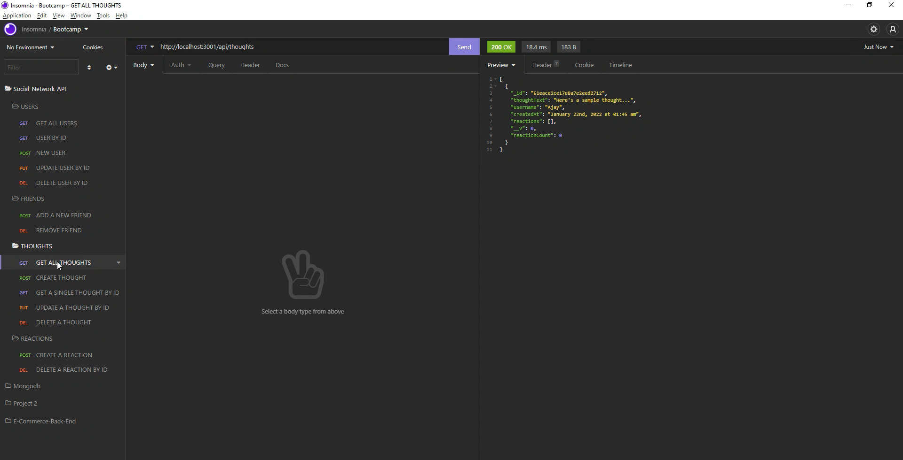

# 18 NoSQL: Social Network API


## Description 

MongoDB is a popular choice for many social networks due to its speed with large amounts of data and flexibility with unstructured data.

For this project my task was to build an API for a social network web application where users can share their thoughts, react to friends’ thoughts, and create a friend list. The requirement was to use Express.js for routing, a MongoDB database, and the Mongoose ODM. In addition to using the [Express.js](https://www.npmjs.com/package/express) and [Mongoose](https://www.npmjs.com/package/mongoose) packages, I had the option of using a JavaScript date library or the native JavaScript `Date` object to format timestamps.

I have used the following routes for this application:

```
/api/users
- GET all users
- GET a single user by its `_id` and populated thought and friend data
- POST a new user
- PUT to update a user by its `_id`
- DELETE to remove user by its `_id`

/api/users/:userId/friends/:friendId
- POST to add a new friend to a user's friend list
- DELETE to remove a friend from a user's friend list

/api/thoughts
-GET to get all thoughts
-GET to get a single thought by its _id
-POST to create a new thought (don't forget to push the created thought's _id to the associated user's thoughts array field)
-PUT to update a thought by its _id
-DELETE to remove a thought by its _id

/api/thoughts/:thoughtId/reactions
-POST to create a reaction stored in a single thought's reactions array field
-DELETE to pull and remove a reaction by the reaction's reactionId value

```
Following image shows the application routes in Insomnia. 




## Table of Contents 
- [Installation](#installation)
- [Usage](#Usage)
- [Application-Demo](#Application-Demo)
- [Features](#features)
- [License](#license)


## Installation

After cloning the folder from github to your local machine, open the folder in the code editor. Then install all the necessary dependencies by typing 'npm i'. This will automatically install all dependencies and packages for the application to successfully run. 

After this type 'npm start' to start the server. You will see the message - 
'## Connected on localhost:3001 ##' <br>

This means the application is ready and you can test it using Insomnia.


## Application-Demo

Please click on the following routes to view the application demo:

[USER routes](https://drive.google.com/file/d/1t54ye9eG-nlDczrUEGPizY1M9-cPKvR6/view?usp=sharing)

[FRIENDS routes](https://drive.google.com/file/d/1z5EkxKTtaGa1R73AVNh-UoymKwYlFaDx/view?usp=sharing)

[THOUGHTS routes](https://drive.google.com/file/d/1IHheNY0uRsE5b24MddhfSluoqUDs4-3f/view?usp=sharing)

[REACTIONS routes](https://drive.google.com/file/d/1PkiRsCT8HEDQvUKcWORJ1PdJBM4rXzZy/view?usp=sharing)


## Features 

This appplication has the following features used in it
- Express.js
- Moment 
- Mongoose 
- Nodemon
- Insomnia 
- Regex


## License
This project is released under the [MIT LICENSE](https://img.shields.io/badge/license-MIT-blue)